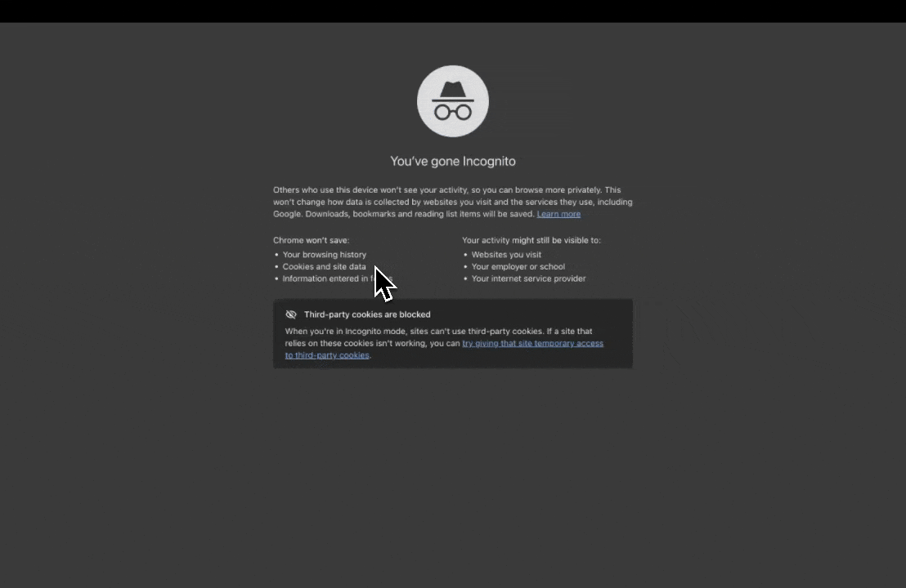

<div align="center">

# typenow

**A black screen. Click anywhere. Start typing.**

[](https://typenow.web.app)

[](LICENSE)
[]()
[](https://github.com/mbron64/typenow/pulls)

<br />



*No accounts. No formatting. No distractions. Just you and your thoughts.*

</div>

---

## What is this?

typenow is a deliberately minimal writing surface. It's a fullscreen black canvas where the only interaction is: **click somewhere, then type**.

Every click places a new independent text block at that exact position. That's it. There are no toolbars, no menus, no save buttons, no settings. The constraint is the feature.

### Use it for

- Braindumps and stream-of-consciousness writing
- Spatial note-taking and mind mapping
- Poetry and creative layout experiments
- Thinking out loud without the overhead of an app

## Try it

**[typenow.web.app](https://typenow.web.app)** -- open it and start clicking.

Or run it locally:

```bash
git clone https://github.com/mbron64/typenow.git
cd typenow
open index.html
```

That's it. No install, no build step, no dependencies.

## How it works

The entire app is a single `index.html` file -- **60 lines** of vanilla HTML, CSS, and JavaScript.

| Click on the black screen | A `contenteditable` div is created at your cursor position |
|---|---|
| Start typing | Text appears in white monospace, wrapping at the viewport edge |
| Click somewhere else | A new independent text block begins there |
| Click into existing text | Resume editing that block |
| Leave a block empty | It's automatically cleaned up on blur |

### Tech stack

```
index.html   ← the entire app
```

No frameworks. No bundlers. No transpilers. No node_modules.

## Contributing

Contributions are welcome. typenow's philosophy is radical simplicity -- any PR should make the experience better without making it more complex.

1. Fork the repo
2. Create your branch (`git checkout -b feature/your-idea`)
3. Commit your changes (`git commit -m 'Add your-idea'`)
4. Push to the branch (`git push origin feature/your-idea`)
5. Open a Pull Request

### Ideas welcome

- Touch/mobile support improvements
- Keyboard shortcuts (e.g. clear screen)
- Persistence via localStorage
- Customizable colors/fonts via URL params
- Export to image

Open an [issue](https://github.com/mbron64/typenow/issues) to discuss before building anything large.

## License

MIT -- do whatever you want with it. See [LICENSE](LICENSE) for details.

---

<div align="center">

**[typenow.web.app](https://typenow.web.app)**

</div>
